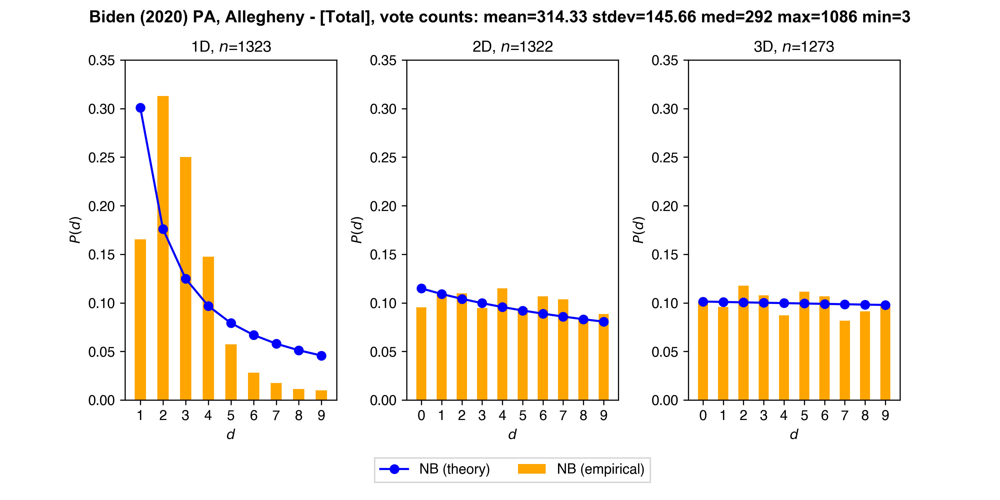
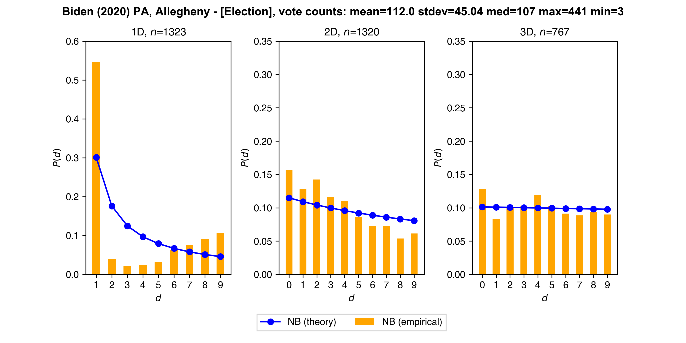
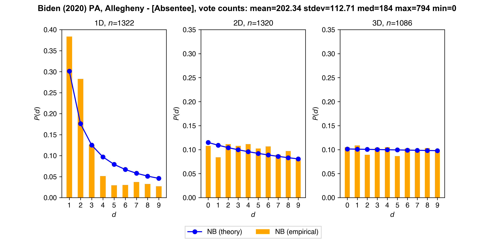
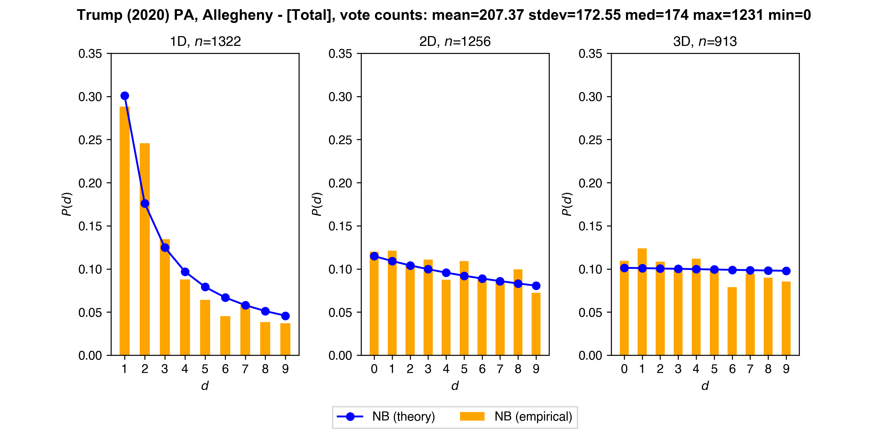
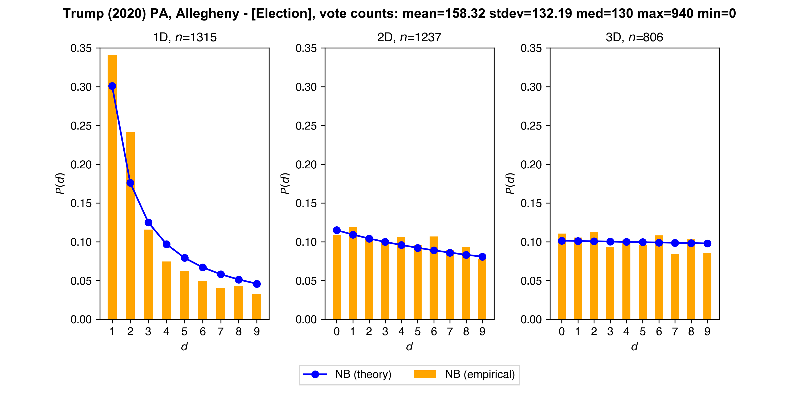
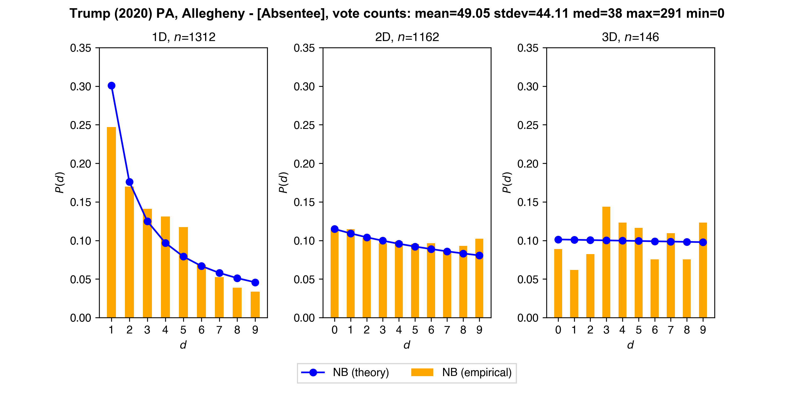
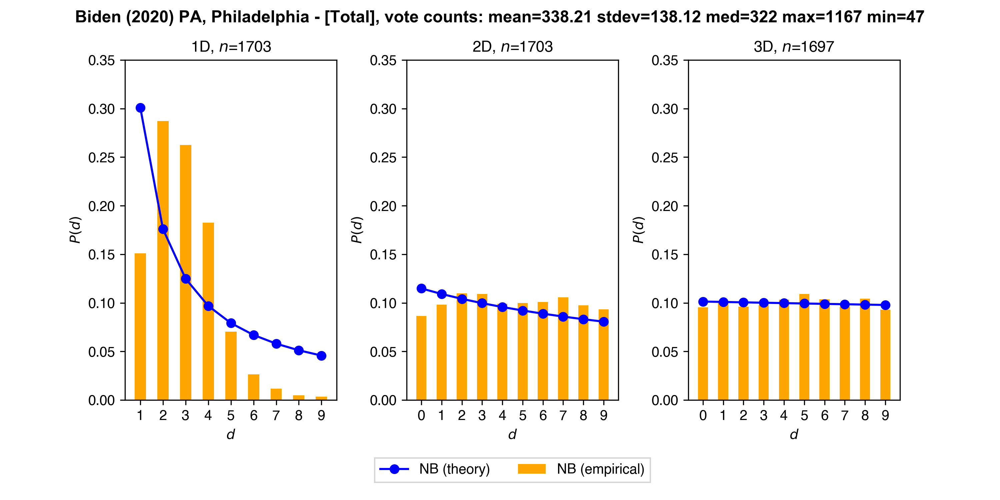
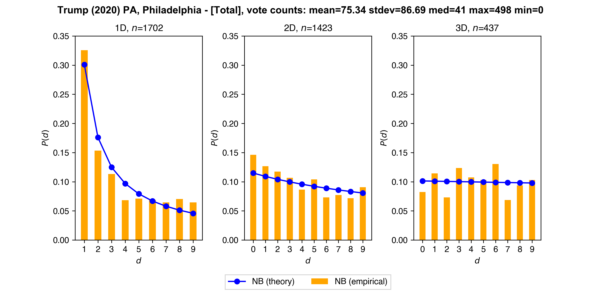
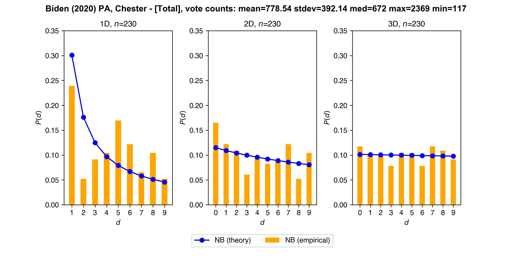
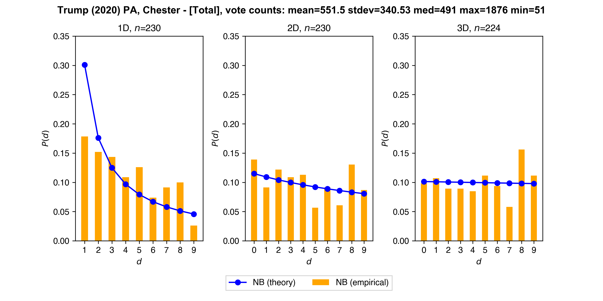

# Pennsylvania

### Newcomb-Benford (NB): First (1D), Second (2D), Third (3D) Digit

* **Allegheny**

  

  *n* is the number of counts. Total is sum of election and absentee vote counts.

  

  

  #

  

  

  
  
* **Philadelphia**

  
  
  

* **Chester**

  
  
  

Note: these are *unofficial* results

Sources: 
* https://results.enr.clarityelections.com/PA/Allegheny/106267/web.264614/#/detail/0004
* https://results.philadelphiavotes.com
* https://pennsylvania.totalvote.com/Chester

