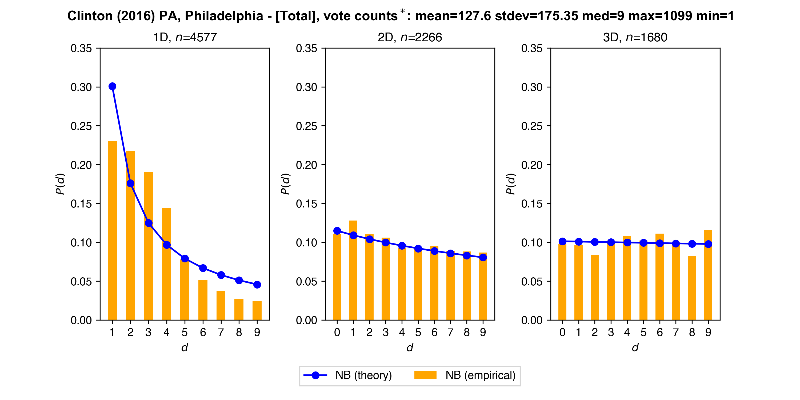
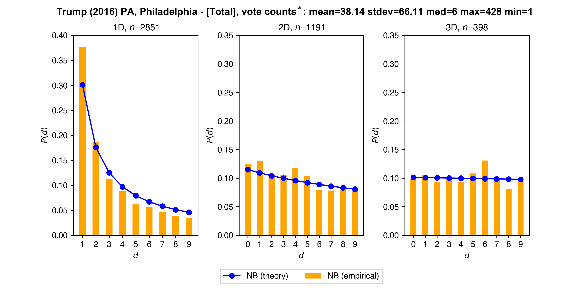
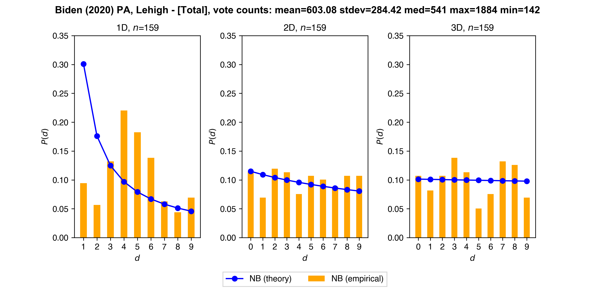
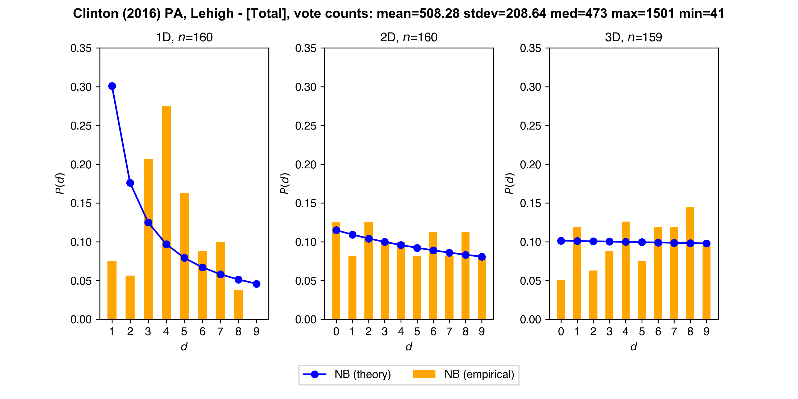
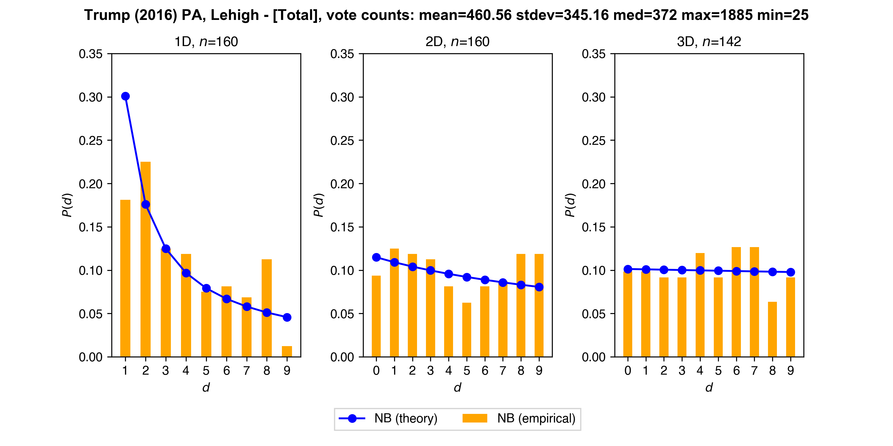

# Pennsylvania

### Newcomb-Benford (NB): First (1D), Second (2D), Third (3D) Digit

* **Allegheny**

  

  *n* is the number of counts. Total is sum of election and absentee vote counts.

  

  

  #

  

  

  
  
* **Philadelphia**

  
  
  

  
  
  

  \* excludes number of zero counts: 481 for Clinton, 2207 for Trump 

* **Chester**

  
  
  

* **Lehigh**

  
  
  

  
  
  

Note: *unofficial* results for 2020

Sources: 
* https://results.enr.clarityelections.com/PA/Allegheny/106267/web.264614/#/detail/0004
* https://results.philadelphiavotes.com
* https://pennsylvania.totalvote.com/Chester
* https://www.philadelphiavotes.com/en/resources-a-data/ballot-box-app
* https://www.lehighcounty.org/Departments/Voter-Registration/Election-Results

